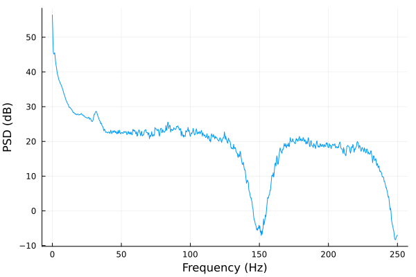

# EEGToolkit

[](https://github.com/slopezpereyra/JEEG.jl/actions/workflows/CI.yml?query=branch%3Amain)


> :last_quarter_moon_with_face: Developed at the [Laboratory for the Study of
> Sleep Slow-wave activity](https://www.med.upenn.edu/slowwavelab/)

A scientific package for computational EEG analysis with an
emphasis on methodological transparency. Current features:

- EEG Computational Toolkit
    - Loading EEG data
    - EEG visualization
    - Sleep stage handling and NREM period detection
    - Power spectral analysis
    - Spindle detection algorithms

### What is an EEG 

In this package, an EEG is a struct with fields 

- `signals`: A dictionary mapping channel names (`String`) to numeric signals `Vector{<:AbstractFloat}`
- `sampling_rates`: A dictionary mapping channel names (`String`) to their sampling rates (`Integer`)
- `epoch_length`: Number of seconds (`Integer`) understood to comprise an epoch.
- `staging`: A `Vector{String}` s.t. the $i$th word in the vector denotes the stage of the $i$th epoch in the EEG. 
-`id`: A `String` identifier for this EEG; defaults to an empty string.

### Reading EEG data

To read an EDF file, 

```julia
eeg_var_name = EEG(file, epoch_length, staging, id)
```

The `EEG` constructor instantiates an `EEG` structure. 

### Spectral analysis

It is straightforward to compute the spectrogram of a signal.


```julia
S = Spectrogram(signal, eeg.fs, 3, 0.5) # Compute spectrogram with 3 second segments and 0.5 segment overlap.
p = plot_spectrogram(S, 30.0, 2) # Plot the spectrogram with limit frequency 30.0; type 2 plot = surface plot.
```


We can also take a look at the spectrogram as a heatmap:

```julia
p = plot_spectrogram(S, 30.0, 1, :inferno) # Color scheme inferno is better for heatmaps
```

 

The power spectrum is easily computed and easily plotted. It is easy to set Welch's method, Barlett's method, 
or direct (no segmentation) PSD estimation. In this case we use Welch's method with 3 second windows and $0.5$ overlap.

```julia
psd = PSD(signal, eeg.fs, eeg.fs * 3,0.5)
plot(psd.freq, pow2db.(psd.spectrum), xlab="Frequency (Hz)", ylab="PSD (dB)", legend=false)
```

The `psd` function has an optional last argument (left unwritten in our example) called 
`normalization`. It represents any additional normalization factor to be used in normalizing 
the PSD.

For transparency, the `PSD` struct contains the fields `method` and `formula`, which 
hold methodological information about how the PSD was computed. This is intended to avoid 
obscurities typical of other packages (for example, what normalization factors 
are being used). In this case,

```
julia> psd.method
"Welch's method"

julia> psd.formula
"1/(M * normalization) ∑ ᵢᴹ [ 2|Hᵢ(f)|² / ∑  wᵢ² ]  where w₁, …, wₗ a Hanning window, M the number of segments, and Hᵢ(f) the FFT of the ith segment of the signal. "
```


 

### Signal filtering 

Our filtering functions are simply wrappers around the `DSP.jl` package 
and are very easy to use. The dispatches of the `filter!` function are:

```julia
sfilter!(eeg::EEG, channel::String, digfilter, cut_off)

sfilter!(eeg::EEG, channels::Vector{<:String}, digfilter, cut_off)

sfilter!(eeg::EEG, digfilter, cut_off)
```

If no channel is given, all EEG signals are filtered. For example,
`filter!(eeg, Lowpass, 1)` applies a low-pass filter with cut-off frequency
$1$Hz to all EEG signals.

### Spindle detection 

This package implements two spindle detection algorithms discussed in [O'Reilly
and Nielsen (2015)](https://doi.org/10.3389/fnhum.2015.00353). We give a brief
overview of them here but refer to their original publications for further
detail.

**Sigma Index Algorithm** : The Sigma Index algorithm [(Huupponen et al.,
2007)](https://pubmed.ncbi.nlm.nih.gov/17555950/) uses the amplitude spectrum to
find spindles by characterizing abnormal values among the spindle frequency
band. Per each $1$ second window of the EEG, $a.$ the
maximum amplitude in the spindle frequency, which we call $S_{max}$, $b.$ the
average amplitude in the low alpha and theta frequencies, which we call
$\alpha_{mean}, \theta_{mean}$, and $c.$ the maximum alpha amplitude
$\alpha_{max}$, are computed. The sigma index is defind to be 

$$f(S_{max}, \alpha_{mean}, \phi_{mean}) = \begin{cases} 
0 & \alpha_{max} > S_{max} \\ 
\frac{2S_{max}}{\alpha_{mean} + \phi_{mean} } & otherwise
\end{cases}$$

Higher values are indicative of a higher spindle probability. The rejection
threshold recommended in the original paper is $\lambda = 4.5$.

The corresponding Julia function is ```sigma_index(x::Vector{<:AbstractFloat}, fs::Integer)```.


**Relative Spindle Power Algorithm** : The Relative Spindle Power (RSP)
algorithm [(Devuyst et al., 2011)](https://pubmed.ncbi.nlm.nih.gov/22254656/)
also uses the amplitude spectrum to find spindles by characterizing abnormal values
among the spindle frequency band. Its approach is more direct and parsimonious,
however. For every $1$ second window, the amplitude spectrum $S(t)$ is computed, and
the RSP is defined as

$$RSP(t) = \frac{\int_{11}^{16} S(t, f) df}{\int_{0.5}^{40} S(t, f) df}$$

This definition is more intelligible than the that of the sigma index, insofar
as it represents the ratio of the total power in the spindle band with respect
to the total power in the delta-theta-alpha-phi frequency range. It is evident
that $0 \leq RSP \leq 1$. Higher values are indicative of a higher spindle
probability---though it should be clear that $RSP$ is not a probability itself.
The rejection threshold recommended in the original paper is $\lambda = 0.22$.

The corresponding Julia function is ```relative_spindle_power(x::Vector{<:AbstractFloat}, fs::Integer)```.

### NREM Period Detection

Following [Feinberg & Floyed](https://pubmed.ncbi.nlm.nih.gov/220659/) and
Dijk, a NREM period is a sequence of epochs satisfying the following two conditions:

- It starts with at least 15 minutes of stages 2, 3 or 4.
- It ends with either $a.$ at least 5 minutes of REM or $b.$ at least 5 minutes
  of wakefulness. 

The sequence is allowed to contain ocurrences of REM sleep or wakefulness, as
long as their duration is inferior to 5 minutes. Naturally, the epochs
corresponding to these ocurrences will not be signaled as NREM.

Furthermore, the restriction that ending REM periods must last at least 5
minutes is not imposed when detecting the first and the last NREM period in a
night of sleep.

Assuming that the `staging` field of the an `EEG` object has been set to a
stage vector $\vec{s}$, and assuming that this vector contains the strings $1, \ldots, 6, ?$ (with $5$ marking REM, $6$ wakefulness, $?$ unknown/unstaged), then calling the

```julia
function nrem(eeg::EEG, n::Integer=30, m::Integer=10)
```

will find the underlying NREM periods. Here, $n$ is the minimum duration
imposed on the NREM sequence (in epochs), and $m$ that imposed to the ending
REM/Wake stages.

The algorithm works by mapping $\vec{s}$ to $\alpha = s_1 \ldots s_q$ a word over $\\{1, 2, 3, 4, 5,6\\}^*$, and decomposing $\alpha$ into the form

$$
\alpha = \psi_1 \phi_1 \psi_2 \phi_2 \ldots \psi_k\phi_k \psi_{k+1}
$$

Here, $\psi_i$ is an arbitrary word and

$$
\phi_i = \varphi_i (5^m5^* + 6^m6^*)
$$

with $\varphi_i \in \\{ w \in \\{1, 2, 3, 4, 6\\}^+ : \text{number of 2, 3, 4s in
} w \geq n \\}$.

Thus, the problem of finding the $k$ underlying NREM periods in a series of
sleep stages becomes the problem of finding the $k$ substrings $\phi_1, \ldots,
\phi_k$ of $\alpha$. This problem is trivial from an implementation
perspective, since programming languages include regular expressions natively.

In the first and last NREM periods, we simply change $\phi_i$ to

$$
\phi_i = \varphi_i (5^+ | 6^m6^*)
$$


