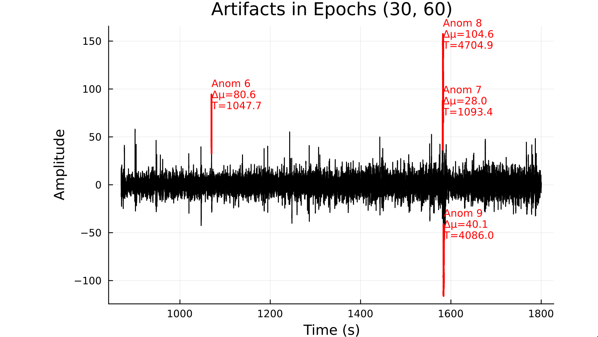

# EEGToolkit.jl

*Computational EEG analysis with emphasis in sleep neuroscience.*

---

> Developed at the [Laboratory for the Study of
> Sleep Slow-wave activity](https://www.med.upenn.edu/slowwavelab/)

---

> The Gods of the earth and sea\
> Sought thro' Nature to find this Tree,\
> But their search was all in vain:\
> There grows one in the Human Brain.
> 
> — William Blake

---


This package has three aims: 
 
- Simplicity
- Transparency
- Efficiency

*Simplicity* means that a person with only basic programming skills should be
able to use it. *Transparency* means that any methodology implemented by the
package should be accessible enough so as to be reported in a scientific paper.
*Efficiency* means that large EEGs (e.g. sleep EEGs) should be processed and
analyzed in seconds.

--- 

> This package is free software—free as in freedom. You are free to use the
> code as you wish and for any purpose. You are free to study the code
> and change it to make it do what you wish. You are free to redistribute
> copies of this package to help others. You are free to distribute copies of
> any modified version of this package. 
>
> Proprietary software hinders the liberty of its users. In science, it
> obscures the scientific process, difficulting replication and collaboration.
> If you are a scientist, use free software whenever possible.

---

## Package Features
- Loading and processing EEG data
- EEG visualization
- Sleep stage handling 
- NREM Period detection
- Power spectral analysis
- Spindle detection algorithms

## Time series


```@docs
TimeSeries
segment
epoch
plot_ts
seconds_to_time
```

## EEG


```@docs
EEG
remove_channel!
plot_eeg
artifact_reject
```

## NREM Period detection 

#### NREM period definition

Following [Feinberg & Floyed](https://pubmed.ncbi.nlm.nih.gov/220659/) and
Dijk, a NREM period is a sequence of epochs satisfying the following
conditions:

- It starts with stages 2, 3 or 4. 
- It contains at least 15 minutes of stages 2, 3 or 4 in total.
- It ends with 5 or more minutes of REM, or with 5 or more minutes
  of wakefulness. 

Epochs in the sequence are allowed to contain occurrences of REM sleep or wakefulness 
in between, as long as the duration of this occurrences is less than 5 minutes.
But the epochs corresponding to these occurrences will not be part of the NREM period. For
example, in a stage sequence of the form

... - 10m of stage two - 1m of REM - 5m of stage three - 5m of REM - ...

the NREM period consists of the first 10 minutes of stage 2 and the 5 minutes
of stage 3, ignoring the 1 minute of REM in-between them.

Importantly, the restriction that ending REM periods must last at least 5
minutes is not imposed when detecting the first and the last NREM period in a
night of sleep.

#### NREM detection algorithm

Let $n$ be the number of epochs corresponding to $15$ minutes and $m$ the
number of epochs corresponding to $5$ minutes. (In 30 second epochs, $n = 30, m
= 10$). 

The algorithm assumes that the  `staging` field of an `EEG` has been set to a
vector $\vec{s}$ that contains only the strings $1,
\ldots, 6, ?$ (with $5$ marking REM, $6$ wakefulness, $?$ unknown/unstaged).

The algorithm works by mapping $\vec{s}$ to $\alpha = s_1 \ldots s_q$ a word over the language
generated by $\Sigma = \{1, \ldots, 6, ?\}$.

Observe that the language $[(5+6)^*(2+3+4)^*]^*$ is partitioned into $U$ and
$U’$, where $U$ is the set of words containing at least $n$ symbols $2, 3,
4$ where neither $5$ nor $6$ occur consecutively $m$ times. Then $\alpha$ can be
decomposed into 

$$\alpha = \psi_1 \phi_1 \psi_2 \phi_2 \ldots \psi_k \phi_k \psi_{k+1}$$

where $\phi_i = \varphi_i (5^m5^* + 6^m6^*)$ and $\varphi_i \in U$.
Such a decomposition readily provides the number of NREM periods in the EEG
(i.e. ``k``). Furthermore, the epochs which comprise these periods are easily
inferable from the decomposition.

```@docs
nrem
```

## Spindle detection

This package implements two spindle detection algorithms discussed in [O'Reilly
and Nielsen (2015)](https://doi.org/10.3389/fnhum.2015.00353). We give a brief
overview of them here but refer to their original publications for further
detail.

```@docs
sigma_index
relative_spindle_power
```

## Power spectral analysis

```@docs
AmplitudeSpectrum
PSD
plot_psd
Spectrogram
plot_spectrogram
freq_band 
mean_band_power
total_band_power
analyze_eeg
```

## Artifact detection 

This package provides an interface of the CAPA statistical method ([Fisch,
Eckley & Fearnhead,
2021](https://onlinelibrary.wiley.com/doi/full/10.1002/sam.11586)) via the
`RCall` package. CAPA is an automated anomaly detection algorithm which performs
in linear time and is specifically designed for time series analysis. The
adaptation provided in this package detects epidemic changes in the mean of 
each segment of the EEG, where the segment length is a parameter. The algorithm
is relatively fast, considering the high complexity of EEG recordings.


> For instance, on a 15.5 million samples EEG
record with 8 channels (all artifact-detected), with a segment length of `30 *
5` seconds, the algorithm took ≈8.6 minutes on a computer with an I3 processor
and 8GB of RAM. That's 8.6/8 = 1.075 minutes per channel, i.e. practically a
minute per each 15.5 million-sized vector, on a mediocre computer.


```@docs
detect_artifacts
plot_artifacts_in_epochs
```

The plot below shows the result of executing the following code: 

```julia 
file = "myedf.edf" 
eeg = EEG(file)
signal = get_channel(eeg, "EEG6")
anoms = detect_artifacts(signal, 60*5)  # epoch length = 5 minutes
plot_artifacts_in_epochs(30, 60, anoms, signal)
```




## Helpers

```@docs
next_power_of_two 
zero_pad 
```

## Examples

#### NREM delta power

This is an example script for computing the mean ``\delta`` (delta) power in
each of the NREM periods of a sleep EEG. We will use the C3 channel.

```julia
# First, import the package
using EEGToolkit 

# Assuming we have the stage data in a .csv and we have some function 
# to read CSVs (e.g. from the CSV package)
staging_df = some_function_to_read_csv("my_staging_data.csv")

# Assuming the csv had a column named STAGES with the stage of each epoch.
staging = staging_df.STAGES

# We read an EEG that has channels C3-A2 and F3-A1. We assume the CSV had a 
# column called STAGES with the stages of each epoch.
eeg = EEG(edf_file)

# We extract the TimeSeries object corresponding to C3-A2
signal = get_channel(eeg, "C3-A2") 

# Detect the NREM periods with default parameters.
nrems = nrem(staging)

# Split the C3 signal into 30-second windows (not-overlapping).
epochs = segment(signal, signal.fs * 30)

# PSD function to be used within each window in the spectrograms
psd = x -> PSD(x, signal.fs, signal.fs * 5)

mean_delta_powers = []
for nrem_period in nrems
    # Extract the portion of the signal corresponding to this NREM period
    # This is a vector of vectors [vector_1, ..., vector_k], with the ith 
    # vector being the ith epoch in this NREM period.
    nrem_epochs = epochs[nrem_period]

    # Compute spectrogram with each window being an epoch of this nrem period.
    spec = Spectrogram(nrem_epochs, nrem_signal.fs*30, psd)

    # Compute mean power in delta band (0.5 to 3.9 Hz) from the spectrogram.
    δ = mean_band_power(spec, 0.5, 3.9)
    # Store the result in the mean_delta_powers list.
    push!(mean_delta_powers, δ)
end

# Now the ith element in `mean_delta_powers` is the mean delta power 
# of the ith NREM period.
```

