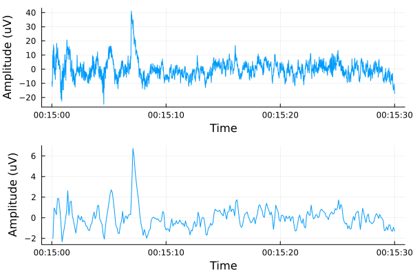
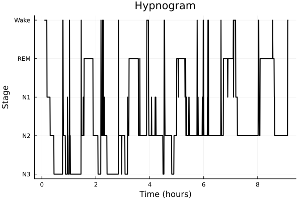
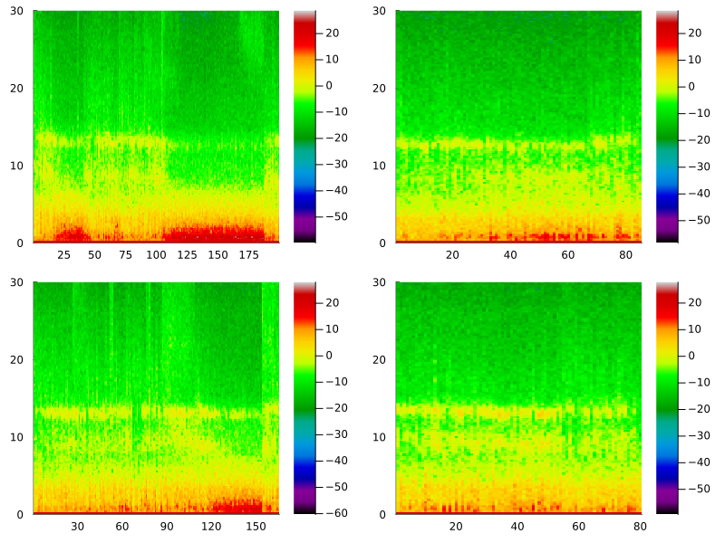
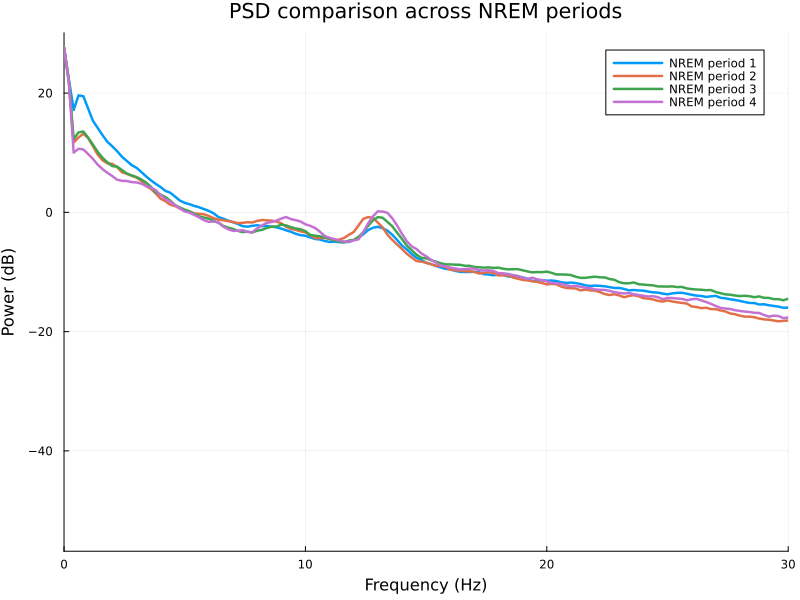
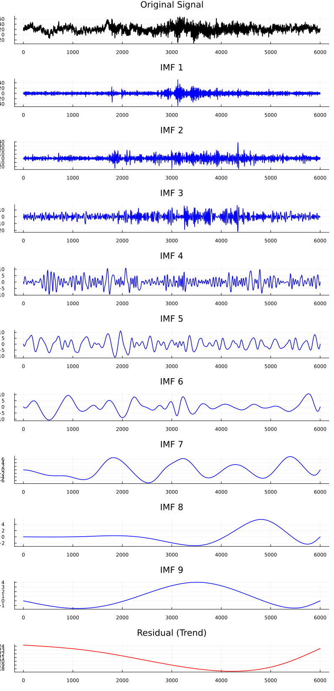
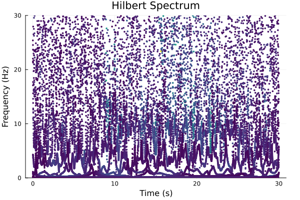
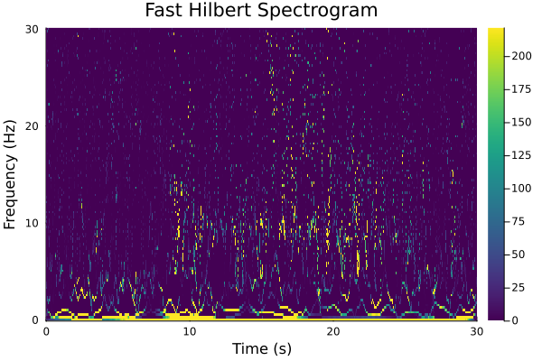

# EEGToolkit.jl

*Computational EEG analysis with emphasis in sleep neuroscience.*

---

> Developed at the [Laboratory for the Study of
> Sleep Slow-wave activity](https://www.med.upenn.edu/slowwavelab/)

---

> The Gods of the earth and sea\
> Sought thro' Nature to find this Tree,\
> But their search was all in vain:\
> There grows one in the Human Brain.
> 
> — William Blake

---


This package has three aims: 
 
- Simplicity
- Transparency
- Efficiency

*Simplicity* means that a person with only basic programming skills should be
able to use it. *Transparency* means that any methodology implemented by the
package should be accessible enough so as to be reported in a scientific paper.
*Efficiency* means that large EEGs (e.g. sleep EEGs) should be processed and
analyzed in seconds.

--- 

> This package is free software—free as in freedom. You are free to use the
> code as you wish and for any purpose. You are free to study the code
> and change it to make it do what you wish. You are free to redistribute
> copies of this package to help others. You are free to distribute copies of
> any modified version of this package. 
>
> Proprietary software hinders the liberty of its users. In science, it
> obscures the scientific process, hindering replication and collaboration.
> If you are a scientist, use free software whenever possible.

---

## Package Features
- Loading and processing EEG data
- EEG visualization
- Resampling and filtering
- Masking and conditional analysis
- Sleep stage handling 
- NREM Period detection
- Power spectral analysis
- Spindle detection algorithms
- Slow Wave detection
- Connectivity metrics (wPLI and coherence)
- Automated artifact detection
- Hypnograms
- Empirical mode decomposition and Hilbert-Huang transform

## Time series


```@docs
TimeSeries
segment
epoch
num_epochs 
trim_to_epochs 
trim_to_epochs!
plot_ts
seconds_to_time
```

## EEG

The `EEG` struct is the core data structure of this package. It encapsulates the
raw EEG data as a dictionary of `String` to `TimeSeries` objects. It also
contains global and channel-specific masks for conditional analysis, in the form
of dictionaries of `Symbol` to `BitVector` data. This information is hidden
from the user and can only be accessed or manipulated through the provided API, 
ensuring data integrity and consistency.


```@docs
EEG
get_channel 
get_channels 
filter_channels
filter_channels!
remove_channel!
plot_eeg
```


## Resampling and filtering

The package provides rational factor resampling to change the sampling rate of a
`TimeSeries`. This is implemented via polyphase filtering (inserting zeros,
low-pass filtering, and decimating) to avoid aliasing artifacts. It also
provides wrappers around DSP functions for filtering raw signals as well as 
time series objects.

```@docs
resample 
apply_lowpass 
apply_lowpass!
apply_highpass
apply_highpass!
apply_bandpass
apply_bandpass!
apply_notch
apply_notch!
```

## Masking and Conditional Analysis

As stated above, this package allows for the use of **masks** (BitVectors) to
perform conditional analysis. Masks allow you to selectively include or reject
specific epochs during analysis without modifying the underlying raw data.

Masks can be stored in the `EEG` struct or created on-the-fly for specific
analyses. Masks associated to an `EEG` object are always named with a symbol,
and are either global (apply to all channels) or channel-specific (see `EEG`
documentation above).


```@docs
get_masks
add_mask!
stage_mask
```


## NREM Period detection 

#### NREM period definition

Following [Feinberg & Floyd](https://pubmed.ncbi.nlm.nih.gov/220659/) and
Dijk, a NREM period is a sequence of epochs satisfying the following
conditions:

- It starts with stages 2, 3 or 4. 
- It contains at least 15 minutes of stages 2, 3 or 4 in total.
- It ends with 5 or more minutes of REM, or with 5 or more minutes
  of wakefulness. 

Epochs in the sequence are allowed to contain occurrences of REM sleep or wakefulness 
in between, as long as the duration of these occurrences is less than 5 minutes.
But the epochs corresponding to these occurrences will not be part of the NREM period. For
example, in a stage sequence of the form

... - 10m of stage two - 1m of REM - 5m of stage three - 5m of REM - ...

the NREM period consists of the first 10 minutes of stage 2 and the 5 minutes
of stage 3, ignoring the 1 minute of REM in-between them.

Importantly, the restriction that ending REM periods must last at least 5
minutes is not imposed when detecting the first and the last NREM period in a
night of sleep.

#### NREM detection algorithm

Let $n$ be the number of epochs corresponding to $15$ minutes and $m$ the
number of epochs corresponding to $5$ minutes. (In 30 second epochs, $n = 30, m
= 10$). 

The algorithm assumes that the  `staging` field of an `EEG` has been set to a
vector $\vec{s}$ that contains only the strings $1,
\ldots, 6, ?$ (with $5$ marking REM, $6$ wakefulness, $?$ unknown/unstaged).

The algorithm works by mapping $\vec{s}$ to $\alpha = s_1 \ldots s_q$ a word over the language
generated by $\Sigma = \{1, \ldots, 6, ?\}$.

Observe that the language $[(5+6)^*(2+3+4)^*]^*$ is partitioned into $U$ and
$U’$, where $U$ is the set of words containing at least $n$ symbols $2, 3,
4$ where neither $5$ nor $6$ occur consecutively $m$ times. Then $\alpha$ can be
decomposed into 

$$\alpha = \psi_1 \phi_1 \psi_2 \phi_2 \ldots \psi_k \phi_k \psi_{k+1}$$

where $\phi_i = \varphi_i (5^m5^* + 6^m6^*)$ and $\varphi_i \in U$.
Such a decomposition readily provides the number of NREM periods in the EEG
(i.e. ``k``). Furthermore, the epochs which comprise these periods are easily
inferable from the decomposition.

```@docs
nrem
```

## Slow wave detection
This package implements the detection of Slow Wave Oscillations (SWO) based on
the negative-peak method described by [Massimini et al.
(2004)](https://pubmed.ncbi.nlm.nih.gov/15190128/). This includes detection,
morphology statistics, and visualization.

```@docs
SlowWave
detect_slow_waves
filter_waves
compute_morphology_metrics
plot_single_wave
plot_average_morphology
```

## Connectivity Metrics

This package allows for the estimation of functional connectivity between EEG
signals, including Weighted Phase Lag Index (wPLI) and Magnitude-Squared
Coherence.

```@docs
compute_wpli
compute_coherence
```

## Spindle detection

This package implements two spindle detection algorithms discussed in [O'Reilly
and Nielsen (2015)](https://doi.org/10.3389/fnhum.2015.00353). We give a brief
overview of them here but refer to their original publications for further
detail.

```@docs
sigma_index
relative_spindle_power
```

## Power spectral analysis

This package allows for power spectral analysis of EEG signals. The `PSD` and
`Spectrogram` constructor functions allow for highly flexible estimation of
power spectra (e.g. Welch or Bartlett methods, with or without windowing, with
or without normalization, etc.). However, the `epoch_spectrogram` is an
off-the-shelf function that computes a spectrogram for an entire EEG signal
following a standard procedure in sleep science. With default parameters, it
divides the signal into 30-second epochs, computes the PSD for each epoch using
Welch's method with Hanning windows (6 overlapping sub-epochs of five seconds
each), and returns the resulting `Spectrogram`. The average spectrum can be
obtained via the `avg_spectra` field of the `Spectrogram` struct.

```@docs
AmplitudeSpectrum
PSD
Spectrogram
plot_psd
plot_spectrogram
freq_band 
mean_band_power
total_band_power
mean_total_band_power
epoch_spectrogram
```

## Artifact detection 

This package provides native Julia implementations for automated artifact
detection in EEG signals. Two distinct approaches are available: one based on
time-domain statistical properties (Hjorth parameters) and another based on
frequency-domain spectral power anomalies (Buckelmueller method).

Both methods operate on 30-second epochs and return a boolean mask where `true`
indicates a rejected (artifact) epoch.

### Hjorth Parameters Method

The `hjorth_artifacts` function detects artifacts using **global
outlier detection** based on Hjorth parameters: Activity (variance), Mobility,
and Complexity.

This method assumes that clean EEG epochs follow a standard distribution of
these parameters. It calculates the global mean and standard deviation for the
entire signal and flags epochs that deviate by more than `z_thresh` standard
deviations.

The algorithm can run for `k` iterations. In each pass, it recalculates the
global statistics (mean/std) excluding the artifacts found in previous rounds.
This progressively "tightens" the threshold, catching smaller artifacts that
were initially masked by extreme outliers.

### Buckelmueller Method

The `buckelmueller_artifacts` function detects artifacts using a **local
spectral power ratio** criterion. This is particularly useful for detecting
transient high-energy events that stand out against their immediate background.

For each epoch, the Power Spectral Density (PSD) is computed, and power is
extracted for the **Delta** (0.6–4.6 Hz) and **Beta** (40–60 Hz) bands. An epoch
is flagged if its band power exceeds the local average of its neighbors (within
a sliding window) by a specified ratio.


```@docs
buckelmueller_artifacts
hjorth_artifacts
```

## Empirical mode decomposition and Hilbert-Huang transform

Empirical mode decomposition (EMD) is a method for decomposing a signal into a
set of intrinsic mode functions (IMFs) that represent oscillatory modes embedded
in the signal. The Hilbert-Huang transform (HHT) is a method for analyzing the
instantaneous frequency and amplitude of the IMFs obtained from EMD. (See [Huang
et al. (1998)](https://doi.org/10.1098/rspa.1998.0193) for more details).

This package provides native Julia implementations of both EMD and HHT, as well
as functions for visualizing the resulting IMFs and their Hilbert spectra. The
EMD implementation uses the standard sifting process to extract IMFs, while the
HHT implementation computes the instantaneous frequency and amplitude of each
IMF using the Hilbert transform. 

```@docs
emd
hht
plot_imfs
plot_hilbert_spectrum
plot_hilbert_heatmap
```


## Helpers

```@docs
next_power_of_two 
zero_pad 
```

## Examples
#### Resampling 

```julia
file = "myeeg.edf" 
eeg = EEG(file)
signal = get_channel(eeg, "EEG6")
resampled = resample(signal, 10.0) # Resample signal to 10Hz.
p1 = plot_ts(signal, 30, 30) # Plot epoch 30
p2 = plot_ts(resampled, 30, 30) # Plot epoch 30

p = plot(p1, p2, layout=(2, 1), link=:x, legend=false)
```



#### Hypnogram 


```julia
staging = CSV.read("staging.csv", DataFrame) # Some staging data
replace!(staging, "NS" => "?", "REM" => "5", "WK" => "6", "N1" => "1", "N2" => "2", "N3" => "3", "N4" => "4") # Convert it to appropriate format (see Staging data type)
staging = Staging(staging) # Convert to Staging data type
p = plot_hypnogram(staging) # Plot
```



#### Artifact detection + masking + power spectral analysis

The following example demonstrates how to iterate through NREM periods, applying
both an inclusion mask (the NREM period itself) and a rejection mask (artifacts
detected via Buckelmueller and Hjorth methods) to compute a clean spectrogram
for each period.

```julia
# Assume `staging` is a Staging object and `eeg` is loaded
nrem_periods = nrem(staging)
ts = get_channel(eeg, "EEG C4-A1")
S = []

for i in 1:length(nrem_periods)
    # 1. Select the current NREM period mask
    nrem_mask = nrem_periods[i]
    
    # 2. Detect artifacts (returns BitVectors where true = artifact)
    b_arts = buckelmueller_artifacts(ts)
    h_arts = hjorth_artifacts(ts; k=10, mask=nrem_mask)
    
    # 3. Combine artifact masks (Union of artifacts)
    art_mask = b_arts .| h_arts

    # Use simple boolean logic to create final mask.
    final_mask = .!(art_mask) .& nrem_mask # Non-artifacted NREM epochs
    
    # 4. Compute Spectrogram 
    # Only includes epochs where nrem_mask is TRUE and art_mask is FALSE
    spectrogram = epoch_spectrogram(eeg, "EEG C4-A1"; mask=final_mask, dB=true)    
    
    push!(S, spectrogram)
end

# Plot each spectrogram for visualization, store plots in list `plots`
# In this example, four NREM periods were detected, so we will have four
# spectrograms to plot.
plots = [plot_spectrogram(s) for s in S]
# Display the plots in 2x2 grid.
plot(plots..., layout=(2, 2), size=(800, 600))

# Let us also plot the average spectrum for each period. v
```




We could have also plotted the average spectrum for each period, which is
obtained via the `avg_spectra` field of the `Spectrogram` struct. This can be easily done constructing a 
`PSD` object from these spectra and plotting it with `plot_psd`, or with some
other custom plotting procedure. For example,  

``` julia
# 1. Prepare the data
# Notice that we are converting power to decibels for plotting purposes.
power_spectrums = [PSD(s.freq, pow2db.(s.avg_spectra)) for s in S]

# 2. Initialize the plot with axis limits and styling
p = plot(
    title = "PSD comparison across NREM periods",
    xlabel = "Frequency (Hz)",
    ylabel = "Power (dB)",
    legend = :topright,
    size = (800, 600),
    xlims = (0, 30),      # Limits the x-axis to 30Hz
    grid = true
)

# 3. Iteratively add each period 
for (i, psd) in enumerate(power_spectrums)
    plot!(p, psd.freq, psd.spectrum, 
          label = "NREM period $i", 
          linewidth = 2.5) 
end

# 4. Display the result
display(p)
```




```julia

#### EMD decomposition 

The following example demonstrates how to apply Empirical Mode Decomposition
(EMD) to one epoch of the EEG. For a full-night EEG, since epoch-by-epoch
looping makes little sense for this method, it would be recommended to resample
the EEG to a lower sampling rate (e.g. 128Hz) and apply EMD to the entire signal
at once. This example is just for demonstration purposes.

```julia
path_to_eeg = "path_to_some_edf"
channel_name = "C4-A1"
eeg = EEG(path_to_eeg)
ts = get_channel(eeg, channel_name) 
# Select one epoch (e.g. epoch 30)
epoch_ts = epoch(ts, 30)
imfs = emd(epoch_ts) # Decompose into IMFs
inst_amp, inst_freq = hht(imfs) # Apply Hilbert-Huang transform to IMFs 

# We generate a 30-sec time range for the plots
n = length(inst_amp[1]) 
t_range = range(0, stop=30, length=n)

# Plot IMFS
p1 = plot_imfs(imfs)  
# Plot Hilbert spectrum 
p2 = plot_hilbert_spectrum(inst_amp, inst_freq, t_range; freq_lims=(0, 30))

# Plot Hilbert spectrogram
p3 = plot_hilbert_heatmap(inst_amp, inst_freq, t_range; freq_lims=(0, 30))
```







