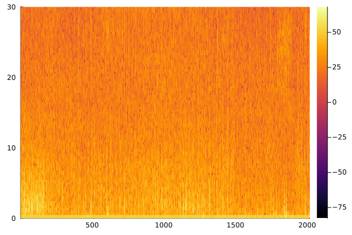

# EEGToolkit.jl

*Computational EEG analysis with emphasis in sleep neuroscience.*

---

> Developed at the [Laboratory for the Study of
> Sleep Slow-wave activity](https://www.med.upenn.edu/slowwavelab/)

---

> The Gods of the earth and sea\
> Sought thro' Nature to find this Tree,\
> But their search was all in vain:\
> There grows one in the Human Brain.
> 
> — William Blake

---


This package has three aims: 
 
- Simplicity
- Transparency
- Efficiency

*Simplicity* means that a person with little programming background should be
able to use it, at least with the documentation at hand. *Transparency* means
that any methodology implemented by the package should be accessible enough so
as to be reported in a scientific paper.  *Efficiency* means that large EEGs
(e.g. sleep EEGs) should be processed and analyzed in minutes or less.

*Transparency* affects primarily power spectral analysis (PSA). Most packages 
don't report how PSA is done. Proprietary software is typically even more
obscure. Combined with the fact that PSA is not standardized and may be
computed in several many ways, this makes it very difficult to compare and rest
results. 

--- 

> This package is free software—free as in freedom. You are free to use the
> code as you wish and for any purpose. You are free to study the code
> and change it to make it do what you wish. You are free to redistribute
> copies of this package to help others. You are free to distribute copies of
> any modified version of this package. 
>
> Proprietary software hinders the liberty of its users. In science, it
> outright obscures the scientific process and makes replication and
> collaboration difficult. If you are a scientist, use free software whenever possible.

---

## Package Features
- Loading and processing EEG data
- EEG visualization
- Sleep stage handling 
- NREM Period detection
- Power spectral analysis
- Spindle detection algorithms

## EEG

```@docs
EEG
epoch
get_stage_indexes 
plot_eeg_overlay 
gen_time_domain
get_stage 
overlaps 
plot_spectrogram
freq_band 
plot_eeg 
artifact_reject
```

## NREM Period detection 

#### NREM period definition

Following [Feinberg & Floyed](https://pubmed.ncbi.nlm.nih.gov/220659/) and
Dijk, a NREM period is a sequence of epochs satisfying the following
conditions:

- It starts with stages 2, 3 or 4. 
- It contains at least 15 minutes of stages 2, 3 or 4 exist in total.
- It ends with 5 or more minutes of REM, or with 5 or more minutes
  of wakefulness. 

Epochs in the sequence are allowed to contain occurrences of REM sleep or wakefulness 
in between, as long as the duration of this occurrences is less than 5 minutes.
But the epochs corresponding to these occurrences will not be part of the NREM period. For
example, in a stage sequence of the form

... - 10m of stage two - 1m of REM - 5m of stage three - 5m of REM - ...

the NREM period consists of the first 10 minutes of stage 2 and the 5 minutes
of stage 3, ignoring the 1 minute of REM in-between them.

Importantly, the restriction that ending REM periods must last at least 5
minutes is not imposed when detecting the first and the last NREM period in a
night of sleep.

#### NREM detection algorithm

Let $n$ be the number of epochs corresponding to $15$ minutes and $m$ the
number of epochs corresponding to $5$ minutes. (In 30 second epochs, $n = 30, m
= 10$). 

The algorithm assumes that the  `staging` field of an `EEG` has been set to a
vector $\vec{s}$ that contains only the strings $1,
\ldots, 6, ?$ (with $5$ marking REM, $6$ wakefulness, $?$ unknown/unstaged).

The algorithm works by mapping $\vec{s}$ to $\alpha = s_1 \ldots s_q$ a word over the language
generated by $\Sigma = \{1, \ldots, 6\}$.

Observe that the language $[(5+6)^*(2+3+4)^*]^*$ is partitioned into $U$ and
$U’$, where $U$ is the set of words containing at least $n$ symbols $2, 3,
4$ where neither $5$ nor $6$ occur consecutively $m$ times. Then $\alpha$ can be
decomposed into 

$$\alpha = \psi_1 \phi_1 \psi_2 \phi_2 \ldots \psi_k \phi_k \psi_{k+1}$$

where $\phi_i = \varphi_i (5^m5^* + 6^m6^*)$ and $\varphi_i \in U$.
Such a decomposition readily provides the number of NREM periods in the EEG
(i.e. ``k``). Furthermore, the epochs which comprise these periods are easily
inferable from the decomposition.

```@docs
nrem
```

## Spindle detection

This package implements two spindle detection algorithms discussed in [O'Reilly
and Nielsen (2015)](https://doi.org/10.3389/fnhum.2015.00353). We give a brief
overview of them here but refer to their original publications for further
detail.

```@docs
sigma_index
relative_spindle_power
```

## Power spectral analysis

```@docs
AmplitudeSpectrum
PSD
Spectrogram
```

## Helpers

```@docs
next_power_of_two 
zero_pad 
```

## Examples

#### NREM delta power

This is an example script for computing the mean ``\delta`` (delta) power in
each of the NREM periods of a sleep EEG. We will use the C3 channel.

```julia
# First, import the package
using EEGToolkit 

# Assuming we have the stage data in a .csv and we have some function 
# to read CSVs (e.g. from the CSV package)
staging = some_function_to_read_csv("my_staging_data.csv")

# We read an EEG that has channels C3-A2 and F3-A1. We assume the CSV had a 
# column called STAGES with the stages of each epoch.
eeg = EEG(edf_file, staging.STAGES)

# Detect the NREM periods
nrems = nrem(eeg)

# Split the C3 signal into 30-second windows (not-overlapping).
epochs = overlaps(eeg.signals["C3-A2"], eeg.fs * 30 * 30, 0)

mean_delta_powers = []
for nrem_period in nrems
    # Extract the portion of the signal corresponding to this NREM period
    nrem_epochs = epochs[nrem_period]

    # Compute its spectrogram. (Observation: This is an example of when it's useful to be 
    # able to pass a vector argument to the Spectrogram constructor.)
    # The spectrogram of each epoch is computed with 5-sec windows wth a 0.5 
    # overlap.
    spec = Spectrogram(nrem_epochs, eeg.fs, eeg.fs*5 - 1, 0.5)

    # Extract delta band (0.5 to 3.9 Hz) from the spectrogram.
    delta_band = freq_band(spec, 0.5, 3.9)

    # Compute the mean power in this delta band
    mean_delta_power = mean(delta_band, dims=2) 

    # Store the result in the mean_delta_powers list.
    push!(mean_delta_powers, mean_delta_power)
end

# Now the ith element in `mean_delta_powers` is the mean delta power 
# of the ith NREM period.
```

#### Power spectrum examples

```julia 

S = Spectrogram(signal, eeg.fs, 3, 0.5) # Compute spectrogram with 3 second segments and 0.5 segment overlap.
p = plot_spectrogram(S, 30.0, 2) # Plot the spectrogram with limit frequency 30.0; type 2 plot = surface plot.
```


Alternatively, 

```julia
p = plot_spectrogram(S, 30.0, 1, :inferno) # Color scheme inferno is better for heatmap
```

 


